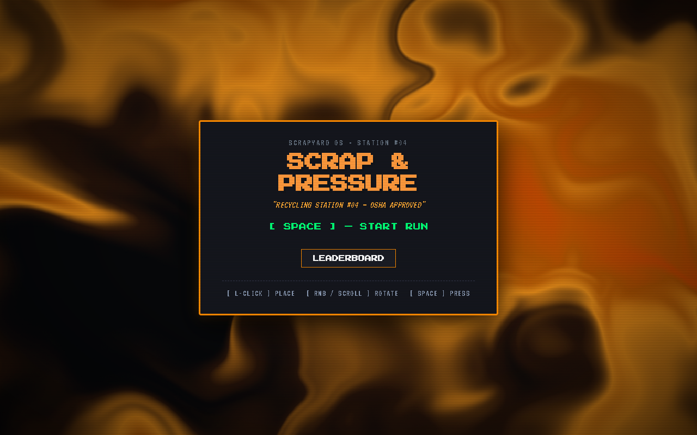
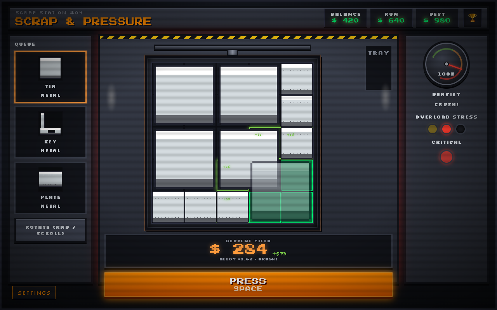
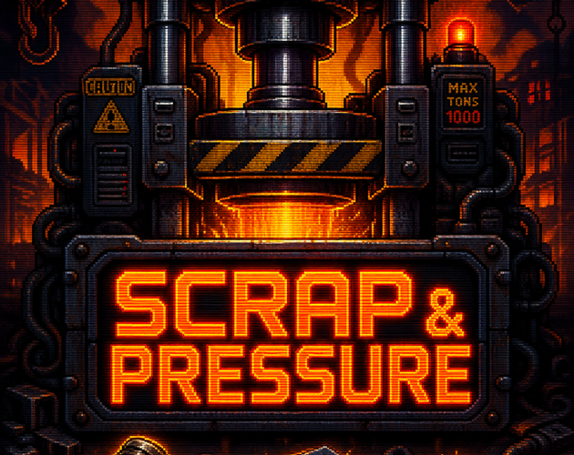

<p align="center">
  
</p>

<p align="center">
  <code>SCRAPYARD OS · STATION #04</code><br/><br/>
  <strong>PACK TIGHT. PRESS HARD.</strong><br/>
  Pack scrap. Slam the press. Draft upgrades. Three overloads and you’re scrap.
</p>

<p align="center">
  
</p>

---

### The loop

1. **Place** shapes from the queue into the chamber  
2. **Rotate** until the density gauge screams  
3. **Press** for payout — alloys and multipliers stack hard  
4. **Draft** upgrades mid-run (expand the chamber, unlock materials)  
5. **Survive** three overload strikes… or shut the station down  

High score lives on the **Top-10 podium**. Claim it.

---

### Controls

| Input | Action |
| --- | --- |
| `L-CLICK` | Place |
| `RMB` / scroll | Rotate |
| `SPACE` | Press |

---

### Run locally

```bash
npm install
npm run dev
```

Open **http://127.0.0.1:5173** — power on the station, then start a run.

```bash
npm run zip:itch   # production build → scrap-and-pressure-itch.zip
```

---

### Stack

Vite · TypeScript · WebGL backdrop · pixel chamber UI

---

<p align="center">
  <br/>
  <sub>Source published for transparency / learning. Ask before commercial redistribution of assets.</sub>
</p>
